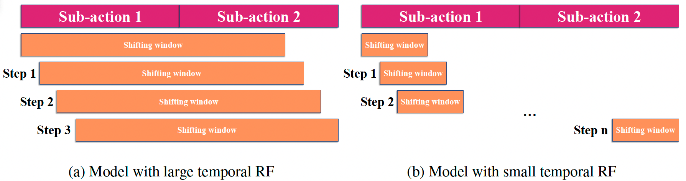

# Video BagNet
Official repository of the paper "Video BagNet: short temporal receptive fields increase robustness in long-term action recognition", published in the ICCV 2023 workshop on Visual Inductive Priors ([arXiv](https://arxiv.org/pdf/2308.11249.pdf)).

# Abstract

Previous work on long-term video action recognition relies on deep 3D-convolutional models that have a large temporal receptive field (RF). We argue that these models are not always the best choice for temporal modeling in videos. A large temporal receptive field allows the model to encode the exact sub-action order of a video, which causes a performance decrease when testing videos have a different sub-action order. In this work, we investigate whether we can improve the model's robustness to the sub-action order by shrinking the temporal receptive field of action recognition models. For this, we design Video BagNet, a variant of the 3D ResNet-50 model with the temporal receptive field size limited to 1, 9, 17, or 33 frames. We analyze Video BagNet on synthetic and real-world video datasets and experimentally compare models with varying temporal receptive fields. We find that short receptive fields are robust to sub-action order changes, while larger temporal receptive fields are sensitive to the sub-action order.


Figure 1. Large (a) versus small (b) temporal RF compared to the sub-action duration. The temporal RF size in the last convolutional layer is represented by the size of the convolutional shifting windows. Models with large temporal RF see sub-actions in ordered co-occurrences, while models with small temporal RF are more likely to see single sub-action occurrences. Because of this, models with small temporal RFs encode sub-action occurrences but not strict sub-action orders.

## Contents

Our Video BagNet model is obtained from a modification of the 3D ResNet-50 model presented by
> Kensho Hara, Hirokatsu Kataoka, and Yutaka Satoh. "Can Spatiotemporal 3D CNNs Retrace the History of 2D CNNs and ImageNet?". *Proceedings of the IEEE Conference on Computer Vision and Pattern Recognition*, 2018.

([code](https://github.com/kenshohara/3D-ResNets-PyTorch))

The implementation of Video BagNet can be found in `models/vid_bagnet_tem.py`. You can use the parameter `--receptive_size` to vary the temporal receptive field of Video BagNet ( 1 | 9 | 17 | 33 ).

## Citation

If you find this work helpful or use the code provided in this repository, please consider citing the paper:

```bibtex
@article{strafforello2023video,
  title={Video BagNet: short temporal receptive fields increase robustness in long-term action recognition},
  author={Strafforello, Ombretta and Liu, Xin and Schutte, Klamer and van Gemert, Jan},
  journal={Proceedings of the IEEE/CVF International Conference on Computer Vision Workshops},
  year={2023}
}
```

## Contact

For any inquiries or questions regarding the paper, code, or experiments, please feel free to contact o.strafforello@tudelft.nl.
